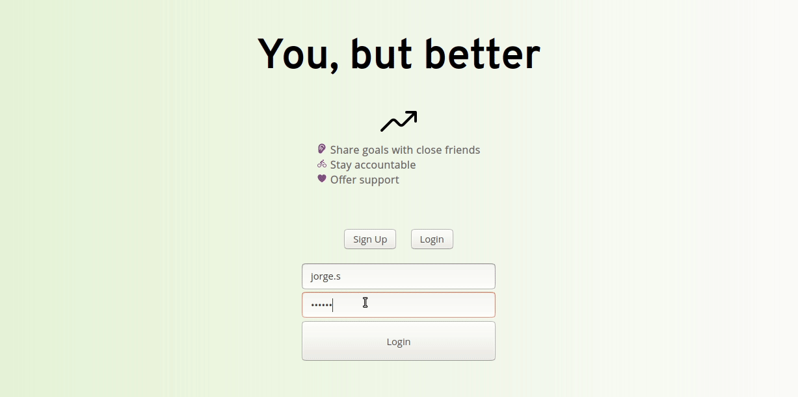

# you-but-better
## Overview
'You, but Butter' is an app to help people keep track of goals using a SMART goal inspired framework.

The app uses a Postgres db, with Rails.
The front-end content is rendered with vanilla Javascript.
This is the first app I've built with authentication, using JWT tokens, allowing users to make accounts customize content.

## User Stories Goals
The idea is to provide an alternative to other social networks that aren't as ideal for being vulnerable about your deeper goals.
As a user, one should be able to...
- Set goals as private (only visible to friend) and public (visible to anyone)
- Add and remove people from your support circle (friends), who can see your private goals
- Message other users regarding their goals (in production)

## Technical Requirements
This project was required to be...
- A Full Stack app, any languages/frameworks were permitted

## How to test the project
1. This is a Ruby app, so you need to make sure you have Ruby installed on your system.
2. The Ruby version used in development was `ruby 2.6.5p114 (2019-10-01 revision 67812) [x86_64-linux]`
3. Clone this repository to your machine, bundle install, and run the rails server on port 4000 (rails s -p4000) and open the index.html file in the frontend folder

## Contributor's Guide
At this time, some additional base functionality needs to be added before it makes sense to ask for contributor help.

## Preview Image

## Videos
1. Overview (Login, see example user data)

